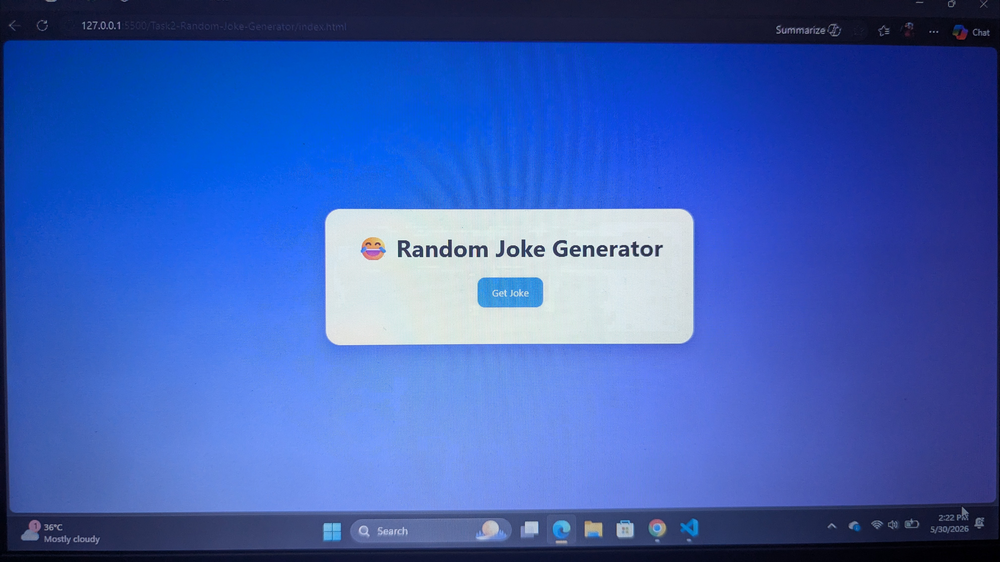
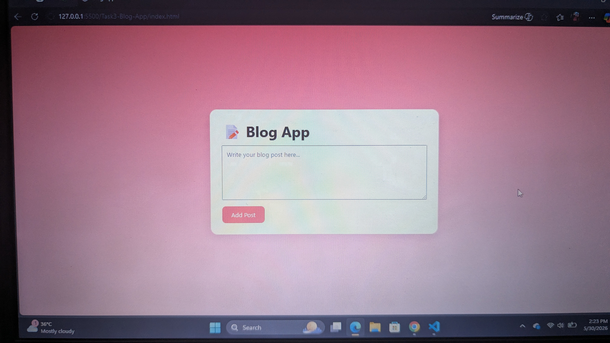
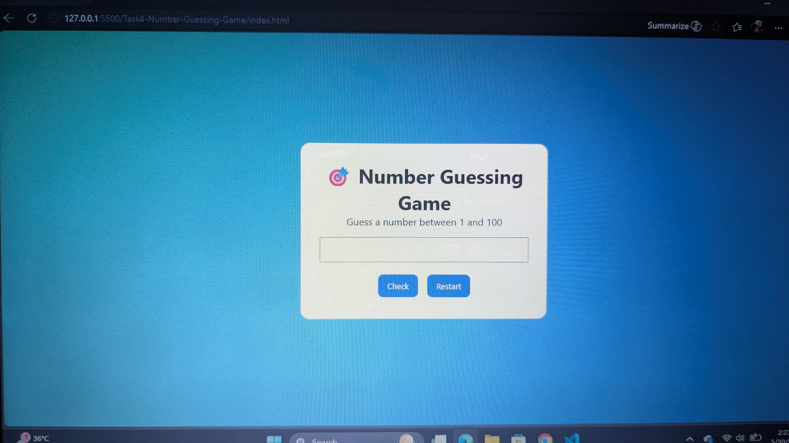
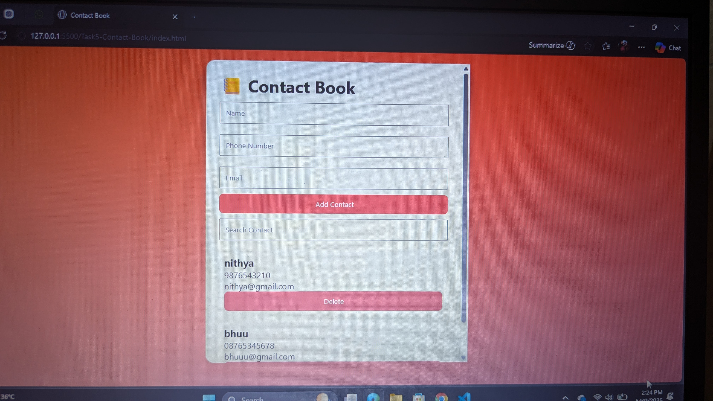

# 🚀 Saiket Internship Projects

## 📌 Overview
This repository contains **five web development projects** developed using **HTML, CSS, and JavaScript** as part of my internship learning journey.

These projects focus on improving **frontend development skills, JavaScript logic building, API handling, and local storage usage**.

---

## 📂 Projects

---

### 🧮 Task 1 - EMI Calculator

A simple EMI calculator that helps users calculate loan repayment details.

**✨ Features:**
- Monthly EMI calculation
- Total payment display
- Total interest calculation
- Input validation
- Reset functionality

**🛠️ Technologies:**
- HTML
- CSS
- JavaScript

---

### 😂 Task 2 - Random Joke Generator

A fun application that fetches jokes from an external API.

**✨ Features:**
- Fetch jokes using API
- Display setup and punchline
- Error handling for failed requests

**🛠️ Technologies:**
- HTML
- CSS
- JavaScript
- Fetch API

---

### 📝 Task 3 - Blog App

A simple blog application to create and manage posts.

**✨ Features:**
- Add blog posts
- Delete blog posts
- Data persistence using Local Storage

**🛠️ Technologies:**
- HTML
- CSS
- JavaScript
- Local Storage

---

### 🎮 Task 4 - Number Guessing Game

An interactive number guessing game with attempt tracking.

**✨ Features:**
- Random number generation
- User input validation
- Attempt counter
- Restart game option

**🛠️ Technologies:**
- HTML
- CSS
- JavaScript

---

### 📒 Task 5 - Contact Book

A contact management application for storing and managing contacts.

**✨ Features:**
- Add contacts
- Search contacts
- Delete contacts
- Local storage support

**🛠️ Technologies:**
- HTML
- CSS
- JavaScript
- Local Storage

---

**🎯 Purpose:**
To strengthen JavaScript fundamentals like DOM manipulation, event handling, and logic building.

## 📸 Screenshots

### Task 1 - EMI Calculator

### Task 2 - Joke Generator

## Task 3 - Blog App

### Task 4 - Number Guessing Game

## Task 5 - Contact Book

## Author

Hi, I’m Nithya Sree, a student passionate about web development and continuously improving my skills through real-world projects.

GitHub:tatakulanithyasree1311@gmail.com
LinkedIn:www.linkedin.com/in/nithyasree-tatakula-030436340
Email:tatakulanithyasree1311@gamil.com

## 🚀 Portfolio Summary

This internship helped me gain hands-on experience in:
- Frontend development using HTML, CSS, JavaScript
- API integration and asynchronous programming
- Local storage management
- UI/UX improvements
- Building real-world mini projects